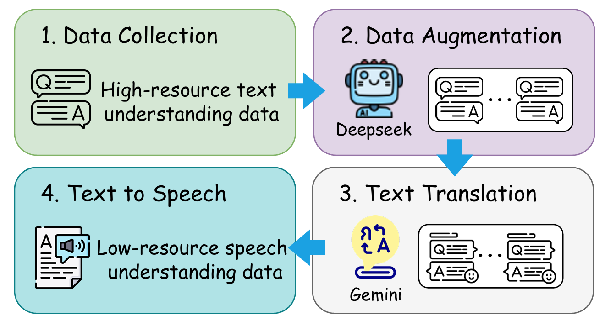

# Thai-Understanding: Thai-SUP & XLSR-Thai

## Overview

**Thai-Understanding** is an open-source repository that provides a solution for speech understanding in the Thai language. This repository includes:

1. **Thai-SUP**: The first open-source Thai speech understanding dataset, which includes over 1,000 hours of data across three tasks: Intent Classification (IC), Named Entity Recognition (NER), and Speech Rephrasing (SR).
2. **XLSR-Thai**: The first large-scale self-supervised learning (SSL) speech encoder for Thai. Built on top of the XLSR model, XLSR-Thai is pre-trained using 36,000 hours of Thai speech data including 16，000 hours of gigaspeech2 and MSR-86k and 20,000 hours of in-house speech data, making it the most powerful encoder for Thai speech understanding to date.

<p align="center">
  
</p>
<p align="center">
  Figure 1：Thai-SUP pipeline. Thai-SUP generates low-resource Thai speech understanding data from high-resource English text corpora using LLM-based data augmentation, translation, and TTS.
</p>

## Thai-SUP
To address the scarcity of speech understanding data in low-resource languages, we build the Thai-SUP pipeline like Figure, which transfers supervision from high-resource text understanding corpora to low-resource speech understanding datasets. 
The pipeline applies LLM-based augmentation to diversify texts, translates the augmented texts into the target language, performs colloquialization and quality filtering to ensure text-to-speech (TTS) suitability, and finally synthesizes audio via TTS, thereby constructing large-scale paired speech–text supervision for speech understanding.

As for Thai, we start from open-source English text understanding datasets, SNIPS for IC and WikiANN / CONLL-2023 for NER. 
Each original example is augmented via DeepSeek-v3, generating ten synthetic variants per instance. 
These candidates are then filtered with Gemini-2.5-flash to remove examples that are unsuitable for downstream speech tasks. 
The remaining English examples are translated into colloquial, spoken-style Thai and rendered into speech using a Thai fine-tuned LLaSa model to produce high-quality speech-to-text pairs.
For the SR task, we use DeepSeek-v3 to mine and select appropriate ASR speech–text pairs that lend themselves to paraphrasing, and apply Gemini-2.5-flash to generate rewritten labels.

- **Intent Classification (IC)**: 648 hours of data
- **Named Entity Recognition (NER)**: 175 hours of data
- **Speech Rephrasing (SR)**: 250 hours of data
  
## XLSR-Thai
While speech encoders trained on ASR tasks tend to capture primarily semantic information, we first introduce the SSL speech encoder for Thai, XLSR-Thai, specifically designed to acquire both linguistic and paralinguistic cues essential for multitask speech understanding. Although the original XLSR model provides general speech representations from multilingual pretraining, it has seen only a few dozen hours of Thai data, leading to weak Thai-specific learning.

To address this, we develop XLSR-Thai by continuously pretraining the XLSR model on a large-scale corpus of 16,000 hours of open-source Thai speech and 20,000 hours of in-house, unlabeled Thai speech. This extensive pretraining yields more robust and generalizable Thai speech representations, allowing XLSR-Thai to capture both linguistic structures and essential paralinguistic cues, making it more effective for multitask speech understanding.

### Experimental Result

**Table 1: CER(%) performance of XLSR-Thai on ASR task.**  
“Giga2 Test” indicates the Gigaspeech2 test dataset, “CV Test” denotes the CommonVoice test dataset.  

| Model                | #Params | Giga2 Test | CV Test |
|----------------------|---------|------------|---------|
| Conformer-giga2      | 150M    | 16.36      | 6.12    |
| monsoon-Whisper-medium-giga2 | 769M    | 14.15      | 6.92    |
| XLSR-AED             | 450M    | 17.72      | 5.73    |
| XLSR-Thai-AED        | 450M    | 14.88      | 4.80    |
| XLSR-CTC             | 300M    | 16.74      | 5.06    |
| XLSR-Thai-CTC        | 300M    | **13.91**  | **3.97** |

**Table 2: Multitask Thai speech understanding results.**  
Evaluation metrics: ACC (%) ↑ for IC, ACC (%) ↑ for NER (NER-ALL for overall, NER-PER for person, NER-ORG for organization, NER-LOC for location, NER-OTH for other entity types); LLM-score (1-5) ↑ for SR; CER (%) ↓ for ASR. Directly-MT trains multitask understanding without pre-alignment.  

| Model                          | IC    | NER-ALL | NER-PER | NER-LOC | NER-ORG | NER-OTH | SR   | ASR   |
|--------------------------------|-------|---------|---------|---------|---------|---------|------|-------|
| Whisper + ASR-based Alignment  | 77.15 | 37.86   | 35.61   | 40.83   | 38.29   | 83.27   | 2.66 | 14.43 |
| Whisper + U-Align (DTW)        | 81.24 | 42.52   | 43.55   | 47.28   | 40.09   | 87.17   | 2.91 | 14.08 |
| XLSR-Thai + Directly-MT        | 82.26 | 39.53   | 41.56   | 40.90   | 39.01   | 88.28   | 2.71 | 14.83 |
| XLSR-Thai + ASR-based Alignment| 81.71 | 43.23   | 47.88   | 46.43   | 41.89   | 87.91   | 2.89 | 13.81 |
| XLSR-Thai + U-Align (CTC)      | 86.98 | 51.07   | 48.77   | 52.31   | 45.43   | 87.69   | **3.10** | 13.51 |
| XLSR-Thai + U-Align (DTW)      | **89.68** | **53.77** | **53.92** | **54.43** | **48.09** | **90.91** | 3.02 | **13.32** |
  
## Usage

### Thai-SUP

Each task directory (Thai-SUP/IC, Thai-SUP/NER, Thai-SUP/SR) has three splits: train, dev, and test.
Each split contains multiple parquet shards.

1) Load with 🤗 Datasets

```python
from datasets import load_dataset

# Load a specific task (e.g. Intent Classification, IC)
ds_ic = load_dataset(
    "mcshao/Thai-understanding",
    data_files={
        "train": "Thai-SUP/IC/train/*.parquet",
        "validation": "Thai-SUP/IC/dev/*.parquet",
        "test": "Thai-SUP/IC/test/*.parquet",
    }
)

print(ds_ic)
print(ds_ic["train"][0])  # show first sample
```
2) Access Audio

The parquet files embed audio bytes (FLAC) together with metadata (e.g., text, label).
To decode audio into waveforms:
```python
import io, soundfile as sf

sample = ds_sr["train"][0]
audio_bytes = sample["audio_flac"]
sr = sample["sampling_rate"]

# Decode from bytes
y, sr2 = sf.read(io.BytesIO(audio_bytes), dtype="float32")
assert sr == sr2
print("Waveform shape:", y.shape, "Sampling rate:", sr)
print("Text:", sample["text"])
```
3) Typical Fields
- task_id: Task type (IC / NER / SR)
- task_prompt: Natural language instruction
- data_id: Unique identifier
- text: Transcription (for SR) or input text
- label: Label (for IC/NER)
- audio_flac: FLAC-compressed audio bytes
- sampling_rate: Audio sampling rate (default 16 kHz)
- num_channels: Number of channels (usually 1)
- duration_s: Duration in seconds

### XLSR-Thai

To load this pretrained wav2vec2.0 checkpoint (XLSR-Thai/checkpoint_best.pt) in Fairseq, simply set model.w2v_path when running training or evaluation. For example:

```shell
fairseq-hydra-train \
  task.data=/path/to/manifests \
  task.labels='["ltr"]' \
  model.w2v_path=XLSR-Thai/checkpoint_best.pt \
  criterion=ctc \
  dataset.train_subset=train \
  dataset.valid_subset=valid \
  distributed_training.distributed_world_size=1
```
Or in Python:

```python
import torch
from fairseq.models.wav2vec import Wav2Vec2Model

ckpt = torch.load("XLSR-Thai/checkpoint_best.pt")
model, cfg, task = Wav2Vec2Model.build_model_and_task_from_checkpoint(ckpt)
model.eval()
```